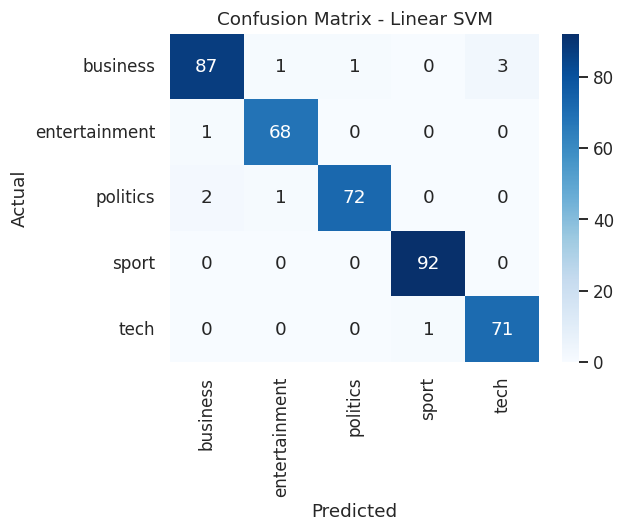
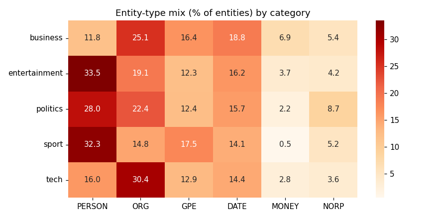
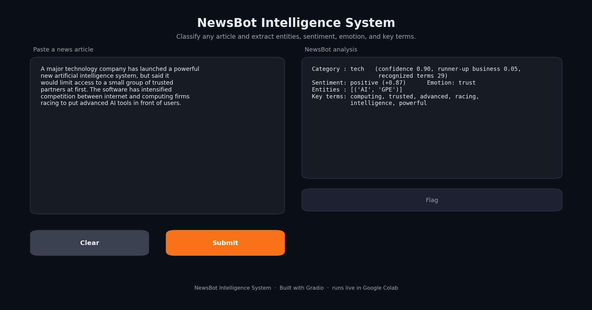

# NewsBot Intelligence System

**ITAI 2373 - Natural Language Processing | Midterm Project**

An end-to-end NLP pipeline that turns raw news articles into structured, decision-ready intelligence. Given any article, NewsBot predicts its **category**, extracts **named entities** (people, organizations, places, dates, money), scores **sentiment and emotional tone**, and surfaces the **linguistic patterns** (key terms, part-of-speech profile, syntactic structure) that distinguish one beat from another. The project integrates all eight course modules into one working system, plus four bonus extensions.

> Author: Trilok Kalani | Group: Individual (solo) | Dataset: BBC News (~2,000 articles, capped from 2,225, across 5 categories)
>
> Repository: https://github.com/Tikskalani/ITAI2373-Portfolio | Project folder: `ITAI2373-NewsBot-Midterm`

---

## What it does

| Module | Component | Technique |
|---|---|---|
| 1 | Application context | Business case for media monitoring / BI |
| 2 | Preprocessing | Lowercase, URL/email strip, tokenize, stop-word removal, WordNet lemmatization (NLTK) |
| 3 | TF-IDF features | `TfidfVectorizer` with unigrams+bigrams, tuned `min_df`/`max_df`/`sublinear_tf` |
| 4 | POS analysis | spaCy tagging, per-category POS distribution |
| 5 | Syntax & semantics | Dependency parsing, Subject-Verb-Object extraction, syntactic features |
| 6 | Sentiment & emotion | VADER + TextBlob, plus a transparent emotion lexicon |
| 7 | Classification | Naive Bayes, Logistic Regression, Linear SVM, Random Forest, compared with CV + held-out test |
| 8 | Named entity recognition | spaCy NER, entity-type mix and top entities per category |
| Integration | `NewsBot.analyze(text)` | Full pipeline on any new article |
| Insights | Cross-module findings, limitations, business value | Section 12 |
| Bonus | Topic modeling, 2D map, custom NER, research extension, Gradio dashboard | Section 13 |

## Headline results

- **Classification: 97.5% test accuracy** (Linear SVM, macro-F1 0.975), with Logistic Regression at 97.0% and all four models above 94%. The only meaningful confusions are a few politics/business articles with overlapping vocabulary.
- **Topic shapes grammar:** sport and entertainment are proper-noun heavy (names); tech and business are the most noun-dense (jargon, figures); politics is the most verb/pronoun heavy (attribution).
- **Tone is topic-dependent:** politics is the most negative and angriest beat; entertainment the most positive and joyful.
- **Entity type is itself a category signal:** business is organization-dominant; entertainment, politics, and sport are person-dominant; sport carries unusually high place mentions.
- **Research finding (bonus):** grammatical style alone predicts the beat at ~0.56 accuracy (vs 0.20 chance), and naively concatenating it with TF-IDF actually lowers accuracy, a useful lesson on feature scaling.
- **Robust predictions:** `NewsBot.analyze` reports how many words it recognized and returns *uncertain* for empty, very short, or out-of-scope input instead of forcing a wrong label. It is demonstrated on five real June 2026 articles (one per category), all classified correctly.

A few representative figures (full output is generated when you run the notebook):




## How to run

### Google Colab (recommended)
1. Open `NewsBot_Intelligence_System.ipynb` in Colab.
2. `Runtime > Run all`. A full run takes about 3 to 5 minutes on a free CPU.
3. The notebook is self-contained. If no dataset file is present it downloads the BBC corpus automatically, so no manual upload or Kaggle key is required. To use the Kaggle source instead, follow the commented instructions in Section 2b.
4. The bonus dashboard (Section 13.4) needs one extra line: `!pip install -q gradio`.

### Local
```bash
pip install -r requirements.txt
python -m spacy download en_core_web_sm
jupyter notebook NewsBot_Intelligence_System.ipynb
```

## Bonus extensions (Section 13)
- **Topic modeling (LDA) + 2D map:** unsupervised topics rediscover the five categories with no labels.
- **Custom domain NER:** a spaCy EntityRuler corrects domain entities (for example tagging *Nvidia* and *Manchester United* as organizations).
- **Research extension:** a cross-validated experiment on whether grammatical style alone predicts the category.
- **Interactive dashboard:** a Gradio UI to paste an article and get the full analysis (runs live in Colab):


- **Video demo (optional, +10):** the notebook's integration section runs five real June 2026 news articles (one per category), all classified correctly, ready to screen-record.

## Repository structure
```
ITAI2373-NewsBot-Midterm/
├── NewsBot_Intelligence_System.ipynb   # main deliverable (8 modules + integration + bonus)
├── newsbot_bbc.csv                      # BBC News dataset (2,225 articles; notebook caps to ~2,000)
├── README.md
├── requirements.txt
├── MT_Report_Group_SOLO_Trilok_Kalani_ITAI2373.pdf   # one-page written report
├── NewsBot_Reflection_TrilokKalani.pdf               # 2-page reflective journal
├── VIDEO_SCRIPT.md                                    # narration for the demo video
└── visualizations/                     # saved result figures
```

## Dataset
BBC News, capped to ~2,000 full-text articles (from the full 2,225) to respect the project's size limit, across five categories (business, entertainment, politics, sport, tech), well balanced (roughly 350 to 460 per class) with a median length around 330 words. Recommended Kaggle source: https://www.kaggle.com/competitions/learn-ai-bbc/data. The notebook also auto-falls-back to the canonical corpus from Greene & Cunningham (2006).

## Design notes
- **Parse once, reuse:** spaCy runs a single pass whose output feeds the POS, syntax, and NER modules. This is the system's main integration point and keeps it inside Colab's free-tier budget.
- **Right tool per job:** NLTK handles fast full-corpus normalization; spaCy's heavier parsing is reserved for the linguistic modules where its accuracy matters, and is run on a stratified sample (`LINGUISTIC_SAMPLE_PER_CLASS`, set to `None` for the full corpus). Classification, TF-IDF, and sentiment use all of the (capped) data.
- **No leakage:** the classification vectorizer is fit on the training split only.

## Known limitations
- The small spaCy model (`en_core_web_sm`) makes occasional NER errors. Section 13.2 shows a rule-based fix, and `en_core_web_trf` or fine-tuning would help further.
- Lexicon sentiment (VADER) misreads domain framing; it can score a profit warning as positive. A finance-tuned model such as FinBERT would be more reliable.
- The emotion lexicon is a deliberately simple, reproducible approximation rather than a trained classifier.

## Contributions
Trilok Kalani (solo). I built the full pipeline myself: data acquisition and preprocessing, TF-IDF feature extraction, the POS, syntax, sentiment, classification, and NER modules, the integration layer with its uncertainty guard, and the four bonus extensions, along with all of the written analysis and interpretation.

## AI-use disclosure
I used an AI assistant to help with code implementation, debugging, visualization, and drafting and structuring this project. I chose the dataset and methods, ran and reviewed all of the code, verified the outputs, and am responsible for the design and interpretation of the results.

## References
- D. Greene and P. Cunningham, "Practical Solutions to the Problem of Diagonal Dominance in Kernel Document Clustering," ICML 2006. (BBC News dataset.)
- Hutto, C.J. & Gilbert, E. (2014). VADER: A Parsimonious Rule-based Model for Sentiment Analysis of Social Media Text. ICWSM.
- spaCy (`en_core_web_sm`); scikit-learn (Pedregosa et al., 2011); NLTK; TextBlob; WordCloud.
